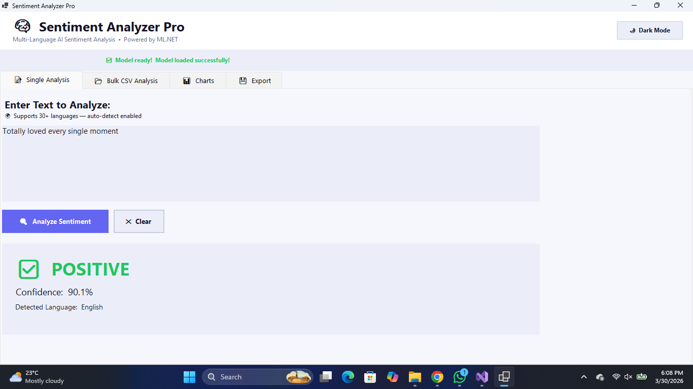
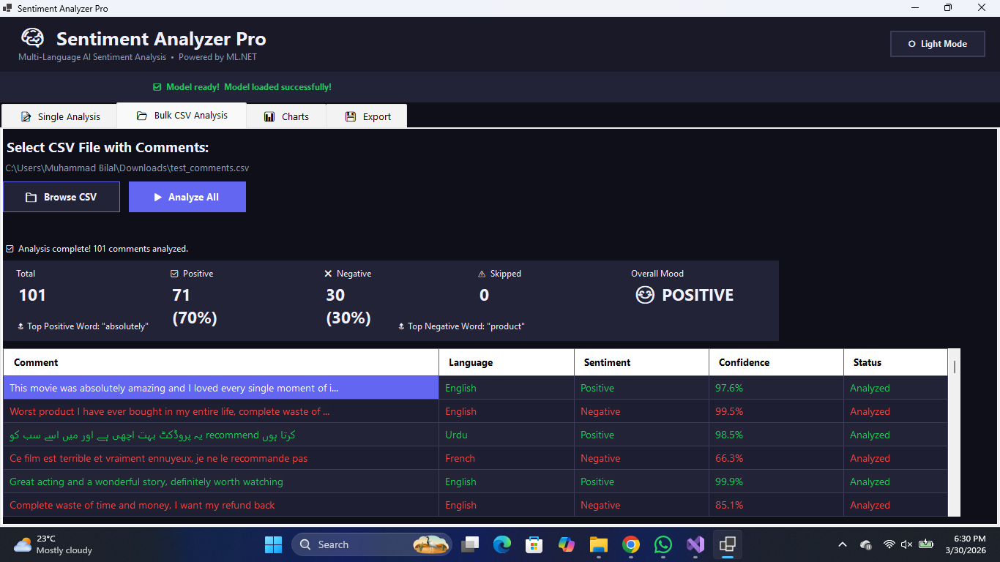
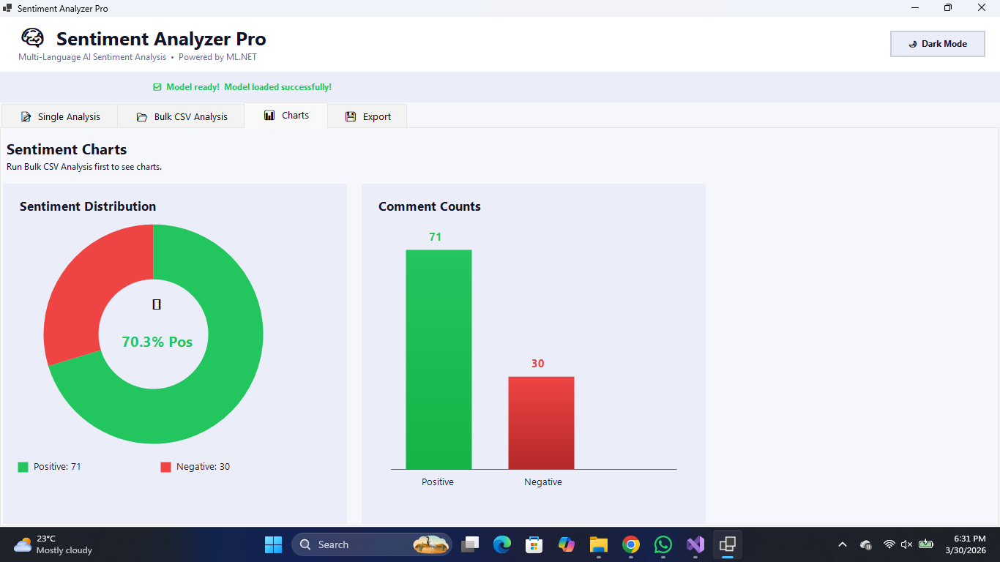
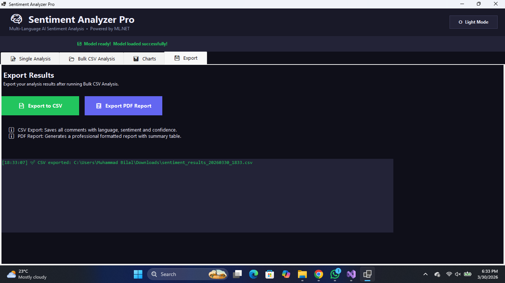
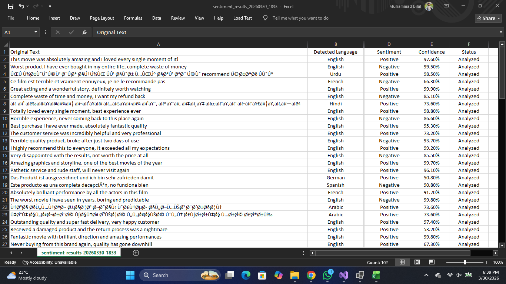

#  Sentiment Analyzer Pro

<div align="center">


**A Multi-Language AI-Powered Sentiment Analysis Desktop Application**  
Built with C# .NET 9 · ML.NET · Windows Forms

---

*Analyzes positive and negative sentiments from text and CSV files*  
*Supports 30+ languages with auto-detection and translation*

</div>

---

##  Table of Contents

- [About the Project](#-about-the-project)
- [Features](#-features)
- [Screenshots](#-screenshots)
- [Tech Stack](#-tech-stack)
- [Dataset](#-dataset)
- [Setup Instructions](#-setup-instructions)
- [How to Use](#-how-to-use)
- [Project Structure](#-project-structure)
- [GitHub Repository](#-github-repository)
- [Developer](#-developer)

---

##  About the Project

**Sentiment Analyzer Pro** is an AI-powered desktop application that detects whether a comment or review is **Positive** or **Negative** using a machine learning model trained on the **IMDB 50K Movie Reviews Dataset**.

The application supports **30+ languages** by integrating the **LibreTranslate API** for automatic language detection and translation. Users can analyze a single comment or upload a **CSV file** with thousands of comments for bulk analysis.

### Problem Statement
Millions of comments are generated daily on social media and review platforms. Manually reading each comment to understand user sentiment is impractical — especially when comments are written in different languages. This application automates the process using AI.

### Objective
- Train an ML.NET model on real review data
- Build a professional Windows Forms UI
- Support multiple languages via translation API
- Visualize results with charts
- Export results to CSV and PDF

---

##  Features

| Feature | Description |
|---|---|
| 🔍 **Single Text Analysis** | Type any comment and get instant sentiment result |
| 📂 **Bulk CSV Analysis** | Upload a CSV file and analyze all comments at once |
| 🌍 **Multi-Language Support** | Auto-detects and translates 30+ languages to English |
| 📊 **Pie Chart** | Visual breakdown of positive vs negative ratio |
| 📈 **Bar Chart** | Comment count comparison chart |
| 💾 **Export to CSV** | Save all analysis results as a CSV file |
| 📄 **Export PDF Report** | Generate a professional PDF report |
| 🌙 **Dark / Light Mode** | Toggle between dark and light themes |
| ⚠️ **Offline Fallback** | English comments always work without internet |
| 🔄 **Progress Tracking** | Real-time progress bar during bulk analysis |

---

##  Screenshots

### Main Interface — Single Analysis Tab


### Bulk CSV Analysis Tab


### Charts Tab


### PDF Export Sample


### Export Result CSV File


##  Tech Stack

| Technology | Version | Purpose |
|---|---|---|
| **C#** | 10.0 | Programming Language |
| **.NET** | 9.0 | Framework |
| **Windows Forms** | Built-in | Desktop UI |
| **ML.NET** | 3.0.0 | Machine Learning |
| **Newtonsoft.Json** | 13.0.3 | JSON Parsing |
| **itext7** | 8.0.3 | PDF Generation |
| **LiveCharts.WinForms** | 0.9.7.1 | Charts |
| **LibreTranslate API** | Free | Translation |
| **Git LFS** | - | Large File Storage |

---

##  Dataset

| Property | Detail |
|---|---|
| **Name** | IMDB Dataset of 50K Movie Reviews |
| **Source** | [Kaggle](https://www.kaggle.com/datasets/lakshmi25npathi/imdb-dataset-of-50k-movie-reviews) |
| **Total Records** | 50,000 reviews |
| **Positive Reviews** | 25,000 (50%) |
| **Negative Reviews** | 25,000 (50%) |
| **File Size** | 63.1 MB |
| **Format** | CSV (`review`, `sentiment`) |
| **Used for Training** | 40,000 records (80/20 split) |

### Model Performance
| Metric | Value |
|---|---|
| Accuracy | **88.5%** |
| AUC | 0.947 |
| F1 Score | 0.884 |
| Training Time | ~90 seconds |

---

##  Setup Instructions

### Prerequisites

Make sure you have the following installed:

- ✅ [Visual Studio 2022](https://visualstudio.microsoft.com/) (Community or higher)
- ✅ [.NET 9.0 SDK](https://dotnet.microsoft.com/download)
- ✅ Git (for cloning)

---

### Step 1 — Clone the Repository

```bash
git clone https://github.com/Muhammad-bilal-503/SentimentAnalysis.NET.git
cd SentimentAnalysis.NET
```

---

### Step 2 — Download the Dataset

1. Go to [Kaggle IMDB Dataset](https://www.kaggle.com/datasets/lakshmi25npathi/imdb-dataset-of-50k-movie-reviews)
2. Download `IMDB Dataset.csv`
3. Place it inside the `Data/` folder:

```
SentimentAnalysis.NET/
└── Data/
    └── IMDB Dataset.csv   ← place here
```

---

### Step 3 — Open in Visual Studio 2022

Double-click `SentimentAnalyzerPro.csproj` to open the project in Visual Studio 2022.

---

### Step 4 — Restore NuGet Packages

In Visual Studio, open **Package Manager Console** and run:

```powershell
dotnet restore
```

Or go to:
```
Tools → NuGet Package Manager → Manage NuGet Packages for Solution → Restore
```

---

### Step 5 — (Optional) Add LibreTranslate API Key

For multi-language translation support, open `Services/TranslationService.cs` and add your free API key:

```csharp
private const string ApiKey = "your-api-key-here";
```

Get a free key at: [libretranslate.com](https://libretranslate.com)

> ⚠️ Without an API key, English comments will still work perfectly. Non-English comments will be marked as "Skipped".

---

### Step 6 — Build and Run

Press **F5** in Visual Studio to build and run the application.

> ⏳ **First Launch:** The ML.NET model will train automatically from the dataset. This takes approximately **1-2 minutes**. After that, the model is saved as `sentiment_model.zip` and loads instantly on future runs.

---

##  How to Use

### Single Text Analysis
1. Click the **📝 Single Analysis** tab
2. Type or paste any comment in the text box
3. Click **🔍 Analyze Sentiment**
4. View result: Positive ✅ or Negative ❌ with confidence %

### Bulk CSV Analysis
1. Click the **📂 Bulk CSV Analysis** tab
2. Click **📁 Browse CSV** and select your CSV file
3. Click **▶ Analyze All**
4. Wait for progress bar to complete
5. View stats panel and results grid

### CSV File Format
Your CSV file should have comments in the first column:
```csv
comment
"This product is amazing!"
"Worst experience ever"
"یہ پروڈکٹ بہت اچھی ہے"
```

### Export Results
- **CSV Export:** Click `💾 Export to CSV` in the Export tab
- **PDF Report:** Click `📋 Export PDF Report` in the Export tab

---

##  Project Structure

```
SentimentAnalysis.NET/
│
├── 📁 Data/
│   └── IMDB Dataset.csv          # Training dataset (add manually)
│
├── 📁 Models/
│   └── ReviewData.cs             # ML.NET data model classes
│
├── 📁 Services/
│   ├── MLService.cs              # Model training & prediction
│   ├── TranslationService.cs     # LibreTranslate API integration
│   ├── SentimentService.cs       # Main orchestrator service
│   └── PdfExporter.cs            # PDF report generator
│
├── 📁 Forms/
│   └── MainForm.cs               # Complete Windows Forms UI
│
├── 📁 screenshots/               # App screenshots (add manually)
│
├── Program.cs                    # Application entry point
├── SentimentAnalyzerPro.csproj   # Project configuration
├── Dockerfile                    # Docker container config
├── .gitignore                    # Git ignore rules
├── .gitattributes                # Git LFS configuration
└── README.md                     # This file
```

---

##  Supported Languages

| Language | Code | Region |
|---|---|---|
| 🇬🇧 English | `en` | Global |
| 🇵🇰 Urdu | `ur` | Pakistan |
| 🇮🇳 Hindi | `hi` | India |
| 🇸🇦 Arabic | `ar` | Middle East |
| 🇫🇷 French | `fr` | France |
| 🇩🇪 German | `de` | Germany |
| 🇪🇸 Spanish | `es` | Latin America |
| 🇨🇳 Chinese | `zh` | China |
| 🇧🇷 Portuguese | `pt` | Brazil |
| 🇷🇺 Russian | `ru` | Russia |
| 🇯🇵 Japanese | `ja` | Japan |
| 🇰🇷 Korean | `ko` | Korea |

> And 20+ more languages supported via LibreTranslate

---

##  GitHub Repository

```
https://github.com/Muhammad-bilal-503/SentimentAnalysis.NET
```

---

##  Developer

| | |
|---|---|
| **Name** | Muhammad Bilal |
| **Roll No** | 232201100 |
| **Institute** | Khan Institute of Computer Science and IT |
| **Department** | Computer Science |
| **Submitted To** | Sir Uzair Hassan |

---

##  License

This project is developed for academic purposes as part of an AI-Based Application Development assignment.

---

<div align="center">

Made with ❤️ using C# · ML.NET · Windows Forms

⭐ **Star this repo if you found it helpful!**

</div>
